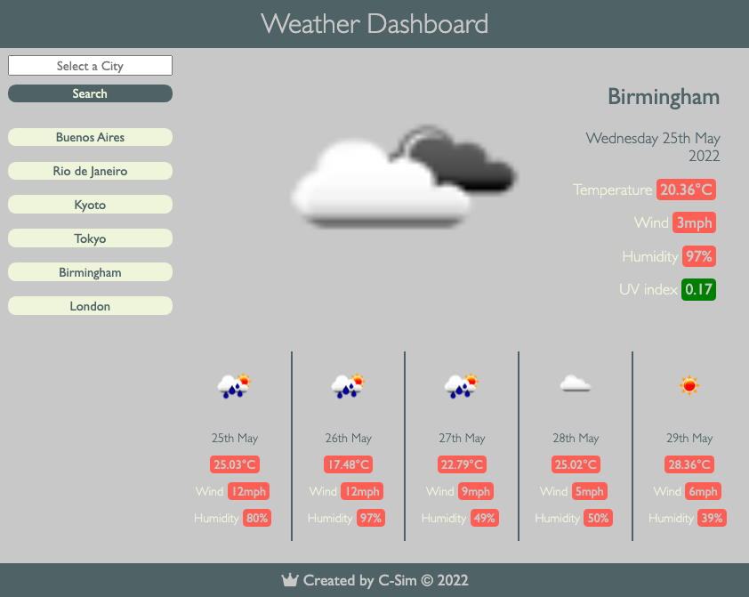
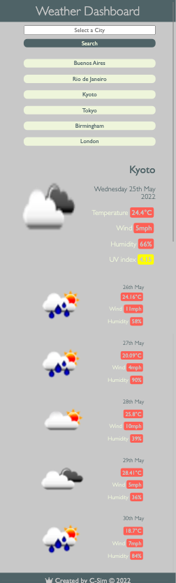

# weather-dashboard

A simple calendar application that allows a user to save events for each hour of the day. The app runs in the browser and features dynamically updated HTML and CSS powered by jQuery.

[Deployed GitHub URL](https://c-sim.github.io/weather-dashboard/)

## Technologies

- HTML
- CSS
- JavaScript
  - Mapping
  - Arrays
  - Conditional Statements
- Web APIs
  - Local Storage
- Third Party APIs
  - OneCall Weather API
  - jQuery
  - JSON
  - Event Listeners
  - Template Strings
  - Document Loading
  - Attributes
  - Targeting
- GitHub Pages

## Screenshots

<details>
<summary>Desktop viewport</summary>



</details>

<details>
<summary>Mobile viewport</summary>



</details>
</br>

## User Story

```
AS A traveler
I WANT to see the weather outlook for multiple cities
SO THAT I can plan a trip accordingly
```

## Acceptance Criteria

```
GIVEN a weather dashboard with form inputs
WHEN I search for a city
THEN I am presented with current and future conditions for that city and that city is added to the search history
WHEN I view current weather conditions for that city
THEN I am presented with the city name, the date, an icon representation of weather conditions, the temperature, the humidity, the wind speed, and the UV index
WHEN I view the UV index
THEN I am presented with a color that indicates whether the conditions are favorable, moderate, or severe
WHEN I view future weather conditions for that city
THEN I am presented with a 5-day forecast that displays the date, an icon representation of weather conditions, the temperature, the wind speed, and the humidity
WHEN I click on a city in the search history
THEN I am again presented with current and future conditions for that city
```

[Contact me by email](mailto:cherelle.s@hotmail.com)
